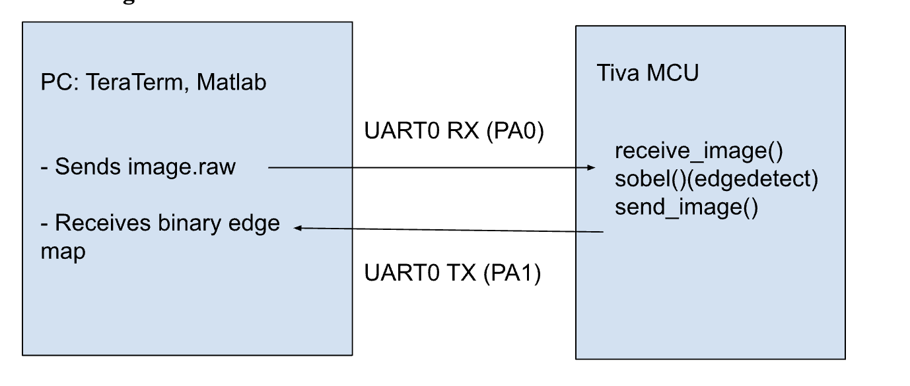

# ECE_425_Final_Project

## Introduction

The objective of this project is to design and implement a complete edge detection system on an embedded microcontroller (the Tiva™ TM4C123GH6PM) using UART communication and grayscale image processing techniques. This project integrates concepts from digital signal processing, embedded systems, and computer vision, demonstrating how resource-constrained hardware can perform fundamental image analysis tasks that are typically handled by more powerful systems.

## Background and Methodology

This project integrates several foundational embedded systems concepts:
Serial Communication (UART): Implemented low-level UART drivers to receive and transmit raw image data using memory-mapped I/O and register-level control.
Memory-Constrained Image Processing: Processed 64x64 grayscale images entirely in SRAM, demonstrating static memory management and optimized buffer usage without dynamic allocation.
Algorithm Implementation on Hardware: The Sobel edge detection algorithm — typically used in computer vision — was implemented in pure C using only integer arithmetic, optimized for real-time performance on a microcontroller.
The outcome is a fully functional edge detection system running on the TM4C123GH6PM, which receives a 64x64 grayscale image from a PC over UART and performs edge detection using the Sobel operator. It then sends the processed edge map back to the PC for visualization.
The project demonstrates the feasibility of basic computer vision on a low-power embedded system with limited memory and no floating-point unit.

### Hardware & Software Components

Tiva C Series TM4C123G LaunchPad - 1 (Texas Instruments)
USB-A to Micro-USB Cabl - 1
EduBase Board - 1 (Trainer4Edu)

### Peripherals Used:

SysTick (millisecond delays)
General-Purpose Timer Module (Timer1) for precise inter-byte timing
UART0 (serial data transfer)
GPIO Port A (PA0, PA1 for UART RX/TX)

### Software Libraries & Tools:

Keil µVision 5 IDE
Python script to convert an image into 64x64 grayscale image png
TeraTerm to log binary bytes of processed image from the Sobel algorithm
MATLAB to reconstruct binary image from TeraTerm binary file

### Components Used

UART0 - Image input/output via serial communication
GPIO Port A - UART TX/RX pins (PA0, PA1)
SysTick- Timing performance/Generating Delays

### Pinout Used

UART0 (RX) - PA0 -- GPIOA, (Pin 0 UART receiver)
UART0 (TX) - PA1 -- GPIOA, (Pin 1 UART transmitter)

## Block Diagram

## Analysis and Results

Video Link for Demonstration: https://vimeo.com/1082353849/5c87082c9f
